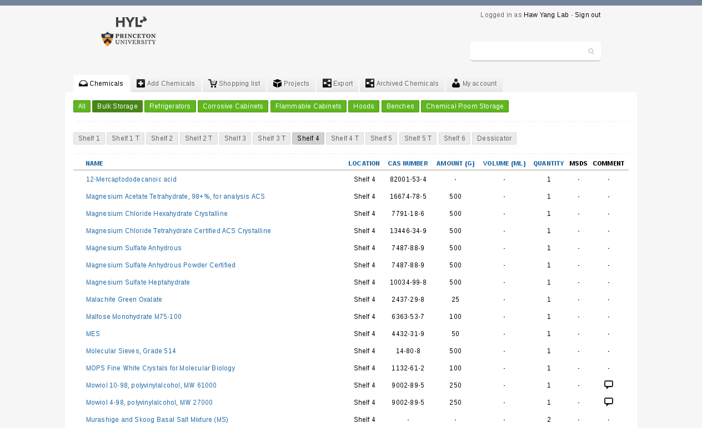
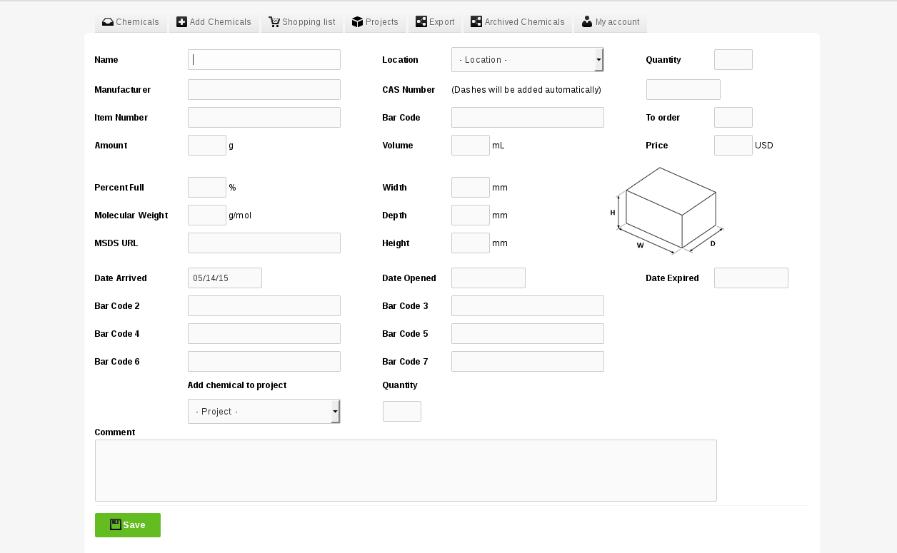

README
====

## What is cheminv

Cheminv is a web-based chemical inventory system.  This responsive database provides an accessable way to organize and order chemicals, and is provided as an open-source package for all non-commercial users.

Cheminv organizes chemicals by their location in a lab. Locations are included in a MySQL database, and the home page provides the ability to sort chemicals by location. You can also search the database by terms such as chemical name or CAS number. The home page provides links to add new chemicals to the database, a shopping list that contains chemicals that have been requested, and a project based listing of chemicals that are in use. You can also export the entire database as a csv file, and view chemicals that have been used in the past (Archived Chemicals).

Each chemical has a page with pertinent information, such as the quantity, manufacturer, CAS number, amount, dates, bar codes, and much more. On the item page users can also indicate that more of a chemical is required, which automatically adds the chemical to a list to be ordered.

The page for adding new chemicals includes fields for all the options above.

## Who and Why

Cheminv was created by Thomas Morrell for the Haw Yang Lab at Princeton University

Cheminv is based on ecDB [www.ecDB.net](http://www.ecdb.net), which was created by [Nils Fredriksson](http://nilsf.se) aka. ElectricMan and designed by [Buildlog](http://buildlog.se). 

### Requirements

-  Web Server.
-  PHP Version 5.2.4 or above.
-  MySQL Version 5.0 - 5.6 (not tested on other versions).

## Installation

- Download the latest stable release from the [download page](https://github.com/tmorrell/cheminv/downloads).
- Create a MySQL database. (mysql -p -e create database cheminv)
- Import `cheminv.sql` database structure to your MySQL-database. (mysql -p cheminv < cheminv.sql)
- Make sure you can access the database (mysql -p grant alter,create,delete,drop,insert,update,select,index ON cheminv.* TO 'cheminvuser'@'localhost' IDENTIFIED BY 'password';) 
- Insert your MySQL data in the configuration files, `include/mysql_connect.php` and 'include/login/config.php'.
- **You are now set to go!** The default username and password should automatically be entered.

- You'll want to edit locations to match your lab setup.  The easiest way in to
  install mysql-workbench and edit table data.  Select cheminv and the
category_head or category_sub tables

## Contributing

cheminv is a community driven project and accepts contributions of code
and documentation from the community. These contributions are made in the form
of Issues or [Pull Requests](http://help.github.com/send-pull-requests/) on
the [cheminv repository](https://github.com/tmorrell/cheminv) on GitHub.

Issues are a quick way to point out a bug. If you find a bug or documentation
error in cheminv then please check a few things first:

- There is not already an open Issue
- The issue has already been fixed (check the develop branch, or look for
  closed Issues)
- Is it something really obvious that you fix it yourself?

Reporting issues is helpful but an even better approach is to send a Pull
Request, which is done by "Forking" the main repository and committing to your
own copy. This will require you to use the version control system called Git.

One thing at a time: A pull request should only contain one change. That does
not mean only one commit, but one change - however many commits it took. The
reason for this is that if you change X and Y but send a pull request for both
at the same time, we might really want X but disagree with Y, meaning we
cannot merge the request. Using the Git-Flow branching model you can create
new branches for both of these features and send two requests.

### Submitting a change

There are two ways to make changes, the easy way and the hard way. Either way
you will need to [create a GitHub account](https://github.com/signup/free).

Easy way GitHub allows in-line editing of files for making simple typo changes
and quick-fixes. This is not the best way as you are unable to test the code
works. If you do this you could be introducing syntax errors, etc, but for a
Git-phobic user this is good for a quick-fix.

Hard way The best way to contribute is to "clone" your fork of ecDB to
your development area. That sounds like some jargon, but "forking" on GitHub
means "making a copy of that repo to your account" and "cloning" means
"copying that code to your environment so you can work on it".

-  Set up Git (Windows, Mac & Linux)
-  Go to the cheminv repo
-  Fork it
-  Clone your cheminv repo: git@github.com:<your-name>/cheminv.git
-  Checkout the "develop" branch At this point you are ready to start making
   changes. 
-  Fix existing bugs on the Issue tracker after taking a look to see nobody
   else is working on them.
-  Commit the files
-  Push your develop branch to your fork
-  Send a pull request http://help.github.com/send-pull-requests/

If your PR is helpful it will be merged into this repo.

## License

-  cheminv is licensed under a Creative Commons [Attribution-NonCommercial-ShareAlike 3.0 Unported License](http://creativecommons.org/licenses/by-nc-sa/3.0/).
-  You are allowed to set up a private cheminv database for yourself, or within an organization.

- cheminv is derived from edDB, which is also licensed under a Creative Commons [Attribution-NonCommercial-ShareAlike 3.0 Unported License](http://creativecommons.org/licenses/by-nc-sa/3.0/).
-  The ecDB code is not allowed for public use other than on  [www.ecDB.net](http://www.ecdb.net).

###### Parts of this readme originates from [CodeIgniter](https://github.com/EllisLab/CodeIgniter)
